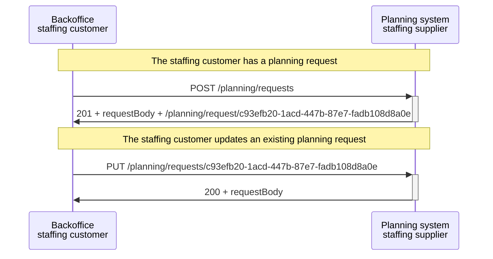
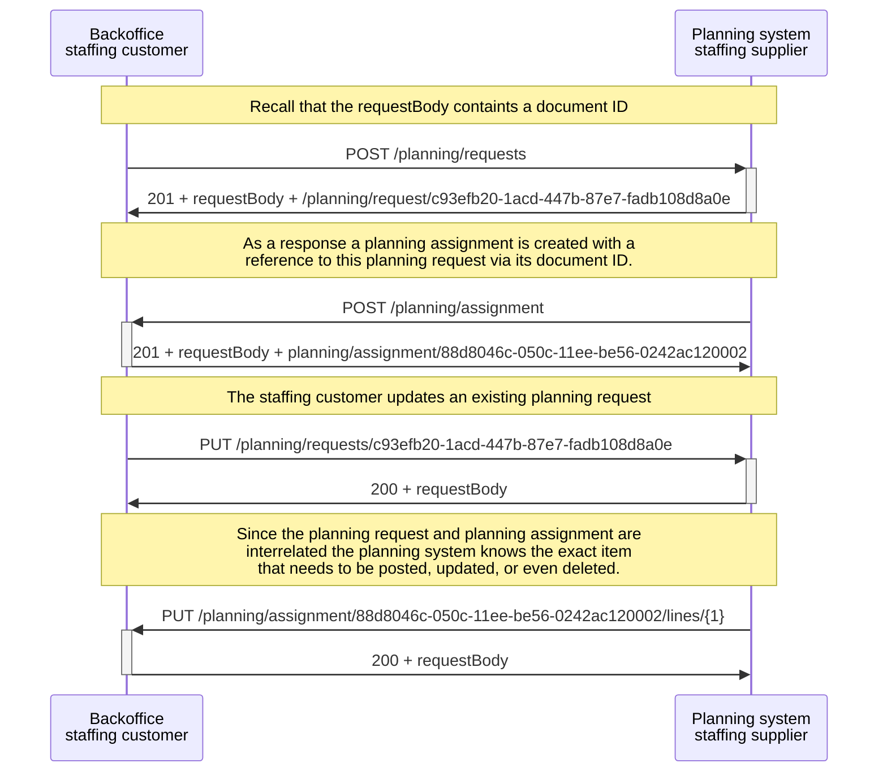
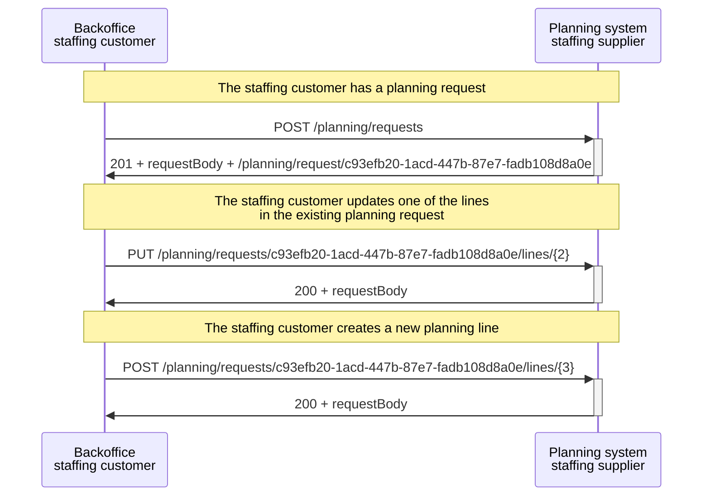

# Handling identifiers

When it comes to the exchange of purchase to pay and planning messages, multiple identifiers come into play. This documentation page will walk you through the IDs and specify their functions. The following ID are taken into account:

1. A unique resource identifier for the (request) messages. This (technical) identifier identifies the location where the resource is stored, allowing it to be referenced later through other API calls.
    - For the Planning & Scheduling messages the resource identifier is assigned by the **API server**. 
    - For the Purchase to Pay messages the resource identifier is assigned by the **API client**. 
2. The document ID included in the message request body itself. This servers more as a business identifier that allows for internal references to other messages
3. An identifier used to reference a specific line in a particular message.

## 1. Resource identifiers

The resource identifier is a universally unique identifier (UUID), which is either assigned by the API client or the API server. This identifier allows the API client to perform GET, PUT and DELETE calls on this resource at a later stage according to the [API specification](../README.md). This means that for the *Purchase to Pay* the **API server** and for the *Planning & Scheduling* the **API client** must keep track of the resource identifiers.

### Purchase to pay

When a new request is made (e.g. `POST /staffing-order/request-for-quotation/{id}`) the **API client** assigns a new identifier to the requested resource. The resource identifier can be passed as a `query parameter` in the path of the POST request. If you were to use this in a POST request, the endpoint might look like this:

```
POST /purchase-to-pay/staffing-order/request-for-quotation/{id}:
```

Where {id} is replaced by the actual UUID identifier, such as:

```
POST /purchase-to-pay/staffing-order/request-for-quotation/c93efb20-1acd-447b-87e7-fadb108d8a0e:
```

This resource identifier, assigned by the API client, might not always be distinct from the document ID in the message body. For some of the Purchase to Pay message these two identifiers might be the same, as long as they are unique for the API server.

### Inlenersbeloning

The rules for the resource identifier that apply to purchase-to-pay also apply to inlenersbeloning. Looking like this:

```
POST /inlenersbeloning{id}:
```

Where {id} is replaced by the actual UUID identifier, such as:

```
POST /inlenersbeloning/c93efb20-1acd-447b-87e7-fadb108d8a0e:
```

This resource identifier, assigned by the API client, might not always be distinct from the document ID in the message body. For some of the Inlenersbeloning message these two identifiers might also be the same, as long as they are unique for the API server.

### Planning and Scheduling

When a new request is made (e.g. `POST /planning/request`) the **API server** assigns a new identifier to the created resource. This resource identifier, assigned by the API server, is distinct from the document ID in the message body, which is assigned by the API client.

The resource identifier is returned in the API response as part of the response header `Location`. E.g.

```
HTTP/1.1 201 Created
Location: /planning/request/c93efb20-1acd-447b-87e7-fadb108d8a0e
```

### Purchase to pay

#### Processing Example

<details>
<summary>Example explanation</summary>
This example illustrates the process of the usage of the resource identifiers. A planning request is created by making a POST request to the API server. Subsequently, the API server generates a resource identifier (UUID) for the newly created planning request. As a result, the staffing customer is able to modify the newly created planning request by using the received resource identifier.
</details>



## 2. Document identifier in the request message

All of the SETU messages also include a document identifier. This identifier is how the API client identifies the request. Any identifier format can be used as long as it is unique within the scope of the issuing party (e.g. the staffing customer).

```xml
<PlanningRequest>
  <documentId>
    <value>46f7b984e63</value>
    <schemeAgencyId>Customer</schemeAgencyId>
  </documentId>
  ...
</PlanningRequest>
```

This document ID is important for the business process, as it is referenced by other messages. For example, a planning assignment can refer to a planning request identifier that it fulfills.

```xml
<PlanningAssignment>
  <documentId>
    <value>2b7e1be8ccf</value>
    <schemeAgencyId>Customer</schemeAgencyId>
  </documentId>
  ...
  <planningRequestReference>
    <documentId>
      <value>46f7b984e63</value> <!-- Reference to the planning request in the example above -->
      <schemeAgencyId>Customer</schemeAgencyId>
    </documentId>
  </planningRequestReference>
  ...
</PlanningAssignment>
```

:::note
See here how the various document IDs of the Purchase to Pay message relate to each other: [identifiers overview](../../purchase-to-pay-v2/usage-notes/Identifiers-overview.md)
:::

#### Processing Example

<details>
<summary>Example explanation</summary>
<p>The document ID helps the receiver to identify whether interrelated resource (e.g., a planning assignment) require modification. Let us consider a scenario where the planning request is interlinked with a planning assignment. An update to an existing planning request requires the staffing supplier to also update the planning assignment. </p>


<p>A good example for the purchase to pay message is provided in the sequence diagram about <a href="../../purchase-to-pay/SequenceDiagrams#changes--deletions">deletions and changes</a>.</p>

</details>



## 3. Line identifiers in the request message

For some SETU message this type of identifier is applicable. For each planning message, it is possible to specify multiple planning lines. In the case of a planning request, these lines can be either periodic or single planning request lines. For the planning constraint message, the lines include periodic and single availability of a human resource. Each line within these messages has its own identifier specified in the message itself, provided by the `line id` element. For the Timecard, the lines include time-interval and allowance, where each line his own `line id` called either `intervalID` or `allowanceID` id. The next examples are focused on the planning messages, but do also hold for the other ones: 

```xml
<periodicAvailabilityLine>
    <lineId>
      <value>1</value>
      <schemeAgencyId>Customer</schemeAgencyId>
    </lineId>
    ...
<periodicAvailabilityLine>
<periodicAvailabilityLine>
    <lineId>
      <value>2</value>
      <schemeAgencyId>Customer</schemeAgencyId>
    </lineId>
    ...
<periodicAvailabilityLine>
```

The line identifiers need to be unique within the scope of the message. Therefore it is allowed to number them sequentially starting with '1', but using a UUID or other identifier format is also allowed.

:::note
Line identifiers are also used as part of certain REST api paths. They are combined with the **resource identifiers** as specified in the [section above](#1-resource-identifiers). For example, `PUT /planning/requests/c93efb20-1acd-447b-87e7-fadb108d8a0e/lines/2` can be used to update the information about a planningline with line ID '2' within a created planning request known by its resource identifier (UUID) as 'c93efb20-1acd-447b-87e7-fadb108d8a0e'.
:::

#### Processing Example

<details>
<summary>Example explanation</summary>
In this scenario, we have a planning request with a single planning line. The creator of this resource intends to make two actions: modifying an existing planning line and posting a new planning line. The process begins with the staffing customer creating a planning request by sending a POST request to the API server. The planning system receives the request and responds with a 201 status code along with the request body and a UUID for the planning request, such as "c93efb20-1acd-447b-87e7-fadb108d8a0e".

Next, the staffing customer wants to modify one of the lines in the existing planning request. They send a PUT request to the API server, where "{2}" represents the line ID to be updated. The staffing customer also wants to add a new planning line. They send a POST request to the API server, where "{3}" represents the new line ID.

</details>


