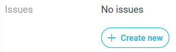

# Public consultation

:::caution DISCLAIMER
The SETU Standard for Inquiry Pay Equity v2.0 is currently under review.

The public consultation period runs from 6 Feb till 27 Feb 2026.
:::

## Where to find the specification?

The management and maintenance of this message specification is carried out in our [SETU standards portal](https://setu.semantic-treehouse.nl/). The message specification can be found here:

- [Inquiry Pay Equity](https://setu.semantic-treehouse.nl/message-model-tree/Message_9733a97f-13ac-44ce-a3fc-9fa2e9cefa5e?panes=element_tree:Message_9733a97f-13ac-44ce-a3fc-9fa2e9cefa5e:p17qjh:primary): for the exchange of Inquiry Pay Equity data.

### Additional documents

The corresponding documentation and API specifications can be found on the next pages of this documentation portal, or check the following links:

- Scenario's: [link](./scenarios.md)
- Example messages and XML & JSON Schemas: [link](https://github.com/setu-standards/xml-specifications/tree/main/setu-gelijkwaardige-beloning)
- API Specifications: [link](https://standard.setu.nl/docs/api/oas-gelijkwaardige-beloning)
- Validator: [link](https://setu.semantic-treehouse.nl/validator/SyntaxBinding_7468e93a-fd12-433b-8c05-0c52f4048cec)
- Other documentation: [link](../README.md)

## How to provide feedback?

Review comments for the public consultation can be submitted via the SETU standards portal itself, where also the message specifications are located. We would like to ask you to submit your review comment at the specific element you have a comment about, by creating a new Issue using the following button:

A login is required to submit your comments. Logging in can easily be done with an existing Microsoft, LinkedIn, Google or GitHub. Only your e-mail address will be visible for us, so we can get in contact with you if we have other questions about your review comment(s).

