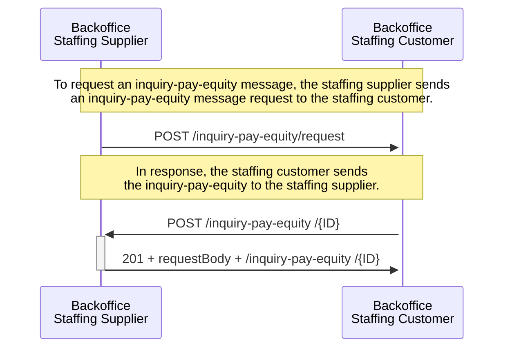
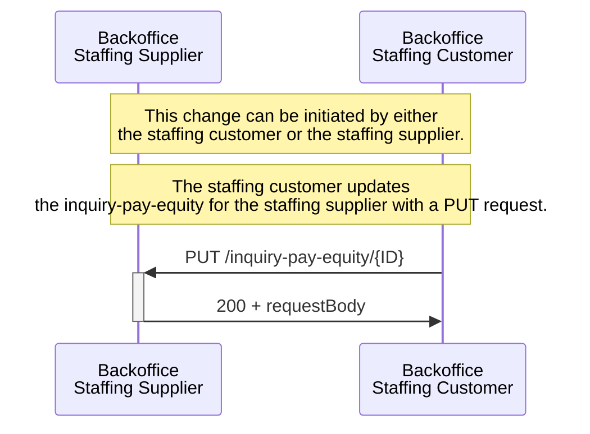
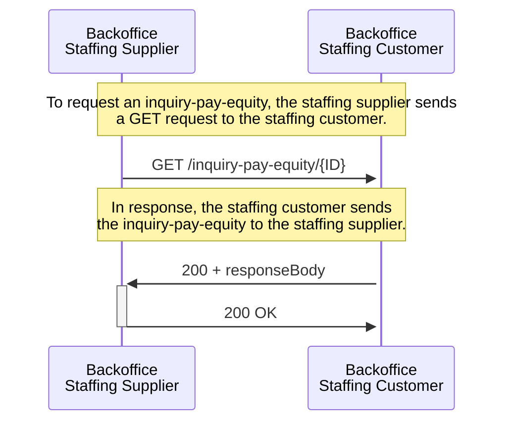
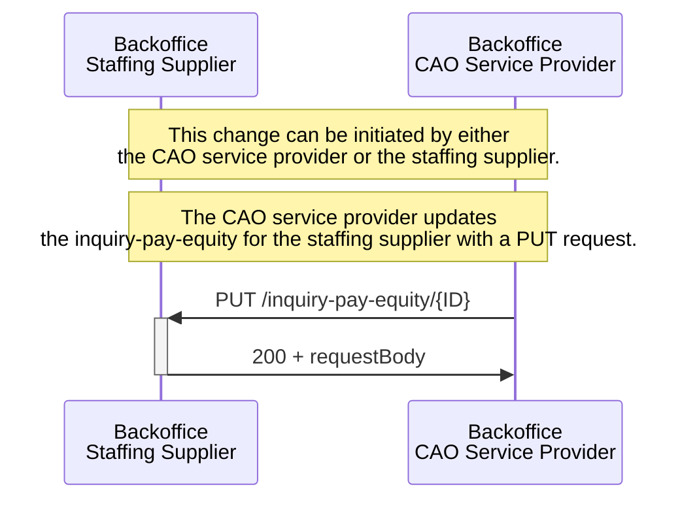

# Sequence diagrams

:::caution DISCLAIMER
The SETU Standard for Inquiry Pay Equity v1.0 is currently under review.

The public consultation period runs from 7 April till 2 May 2025. See [this page](./../public-consultation.md) for more information.

Some documentation in this section is a draft and subject to change. Feedback and suggestions are welcome to help refine and finalize these documents.
:::

The page contains several sequence diagrams illustrating the communication between the backoffice systems of a staffing supplier and a staffing customer and a CAO service provider for exchanging the SETU Inquiry Pay Equity message

### Sending Inquiry Pay Equity data: Staffing Supplier to Staffing Customer

The staffing supplier can request the inquiry pay equity message from the staffing customer when necessary. This is currently out-of-scope, but might be done by sending a `POST /inquiry-pay-equity /request*` to the staffing customer. Upon receiving the request, the staffing customer processes it and returns the relevant inquiry pay equity  data, typically with a `POST /inquiry-pay -quity /{ID}` response. The ID serves as the resource identifier, which the API client assigns to the requested resource. This identifier can be passed as a query parameter in the path of the POST request. It enables the API client to perform GET, PUT, and DELETE operations on the resource later. For more information, read [here](../../api/usage-notes/identifiers.md)

<figcaption align = "left">Diagram 1 - Inquiry Pay Equity process between the staffing customer and the staffing supplier.</figcaption>

 

:::info Inquiry Pay Equity request*
These inquiry-pay-equity  request API calls are currently out of scope. The inquiry-pay-equity  API request is not comparable to the request (uitvraag) made by CAO service providers. This request concerns the trigger for sending the pay equity data.
:::

### Updating Inquiry Pay Equity: Staffing Supplier to Staffing Customer

The staffing customer may need to update the inquiry-pay-equity when there is a change in the remuneration or other relevant information.See below in the details panel how the sequence diagram looks.

<strong>Updating an exiting inquiry-pay-equity</strong>

The staffing customer may need to update the inquiry-pay-equity when there is a change in the remuneration or other relevant information. This is initiated when the staffing customer sends a `PUT /inquiry-pay-equity/{ID}` to the staffing supplier, which includes the updated information. The staffing supplier receives this update and processes it accordingly. It responses with a `200 and a the updated request body` 

<figcaption align = "left">Diagram 2 - Inquiry Pay Equity process between the staffing customer and the staffing supplier.</figcaption>

### Getting Inquiry Pay Equity: Staffing Supplier to Staffing Customer

The staffing supplier can request the inquiry-pay-equity from the staffing customer when necessary. This might be done by sending a `GET /inquiry-pay-equity/{ID}` to the staffing customer. Upon receiving the request, the staffing customer processes it and returns the relevant inquiry-pay-equity data, typically with a 200 OK response. 

<strong>Getting an inquiry-pay-equity</strong>

<figcaption align = "left">Diagram 3 - Inquiry Pay Equity process between the staffing customer and the staffing supplier.</figcaption>

### Staffing Supplier to CAO Service Provider

The exchanges with the CAO service provider follow the same process. Below, in the various detail panels, you can also find the sequence diagrams for this.

<strong>Sending an inquiry-pay-equity</strong>

<figcaption align = "left">Diagram 4 - Inquiry Pay Equity process between the CAO service provider and the staffing supplier.</figcaption>

<strong>Updating an exiting inquiry-pay-equity</strong>

The CAO service provider may need to update the inquiry-pay-equity when there is a change in the remuneration or other relevant information. This is initiated when the CAO service provider sends a `PUT /inquiry-pay-equity/{ID}` to the staffing supplier, which includes the updated information. The staffing supplier receives this update and processes it accordingly. It responses with a `200 and a the updated request body` 

<figcaption align = "left">Diagram 5 - Inquiry Pay Equity process between the CAO service provider and the staffing supplier.</figcaption>

