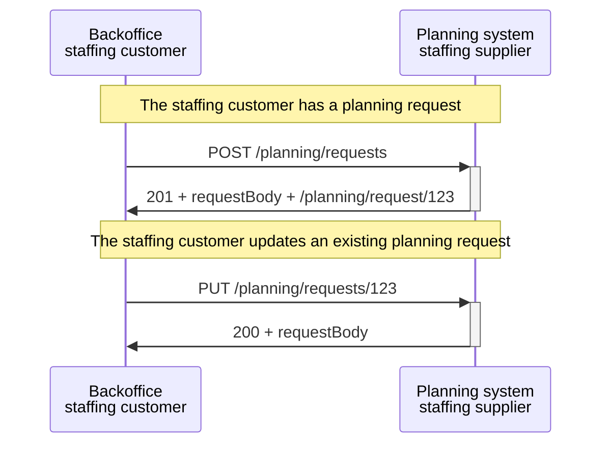
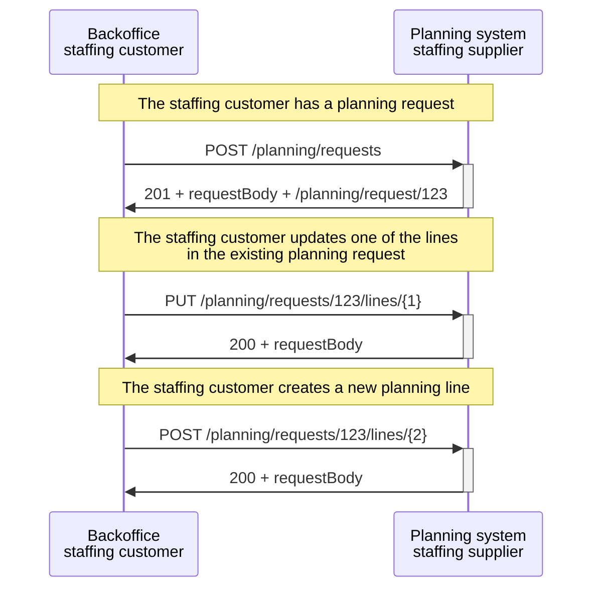
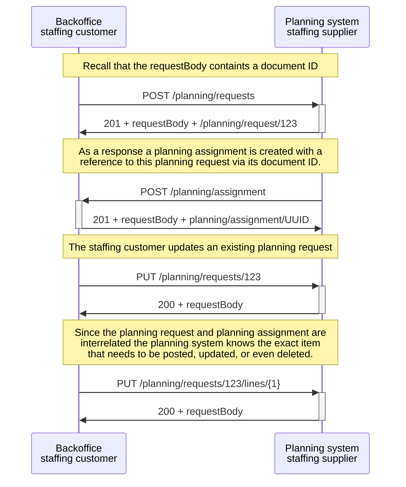

# Examples

## New UUID for modifying planning message:

Let's consider a scenario where a planning request is sent to the planningsystem of a staffing supplier, accompanied by a unique document id and specific line id's. If the planning request is processed successfully, the creator of the planning request will receive a 201 response containing the request body and a new UUID under which the created document is stored. If the creator wants to make modifications to his document, they should provide the obtained UUID so that the staffing supplier knows which document the creator refers to. This enables the creator to do a PUT, DELETE, GET or a POST of a planning line.

The above example is depicted in the following sequence diagram. The received UUID by the creator is 123.

## Line ID in the requestBody:

The line ID's within the message assists the receiver of the message in identifying the specific lines within the requestBody that require updates or even deletion. In this scenario, we have a planning request with a single planning line. The creator of this resource intends to make two actions: modifying the existing planning line and posting a new planning line.

The process begins with the staffing customer creating a planning request by sending a POST request to the planning system at the endpoint "/planning/requests". The planning system receives the request and responds with a 201 status code along with the request body and a UUID for the planning request, such as "123".

Next, the staffing customer wants to modify one of the lines in the existing planning request. They send a PUT request to the planning system at the location "/planning/requests/123/lines/{1}", where "{1}" represents the line id to be updated. The staffing customer also wants to add a new planning line. They send a POST request to the planning system at the location "/planning/requests/123/lines/{2}", where "{2}" represents the new line id.

## Document ID in the requestBody:

The document ID helps the receiver to identify whether interrelated resource (e.g., a planning assignment) require modification. Let us consider a scenario where the planning request is interlinked with a planning assignment.

