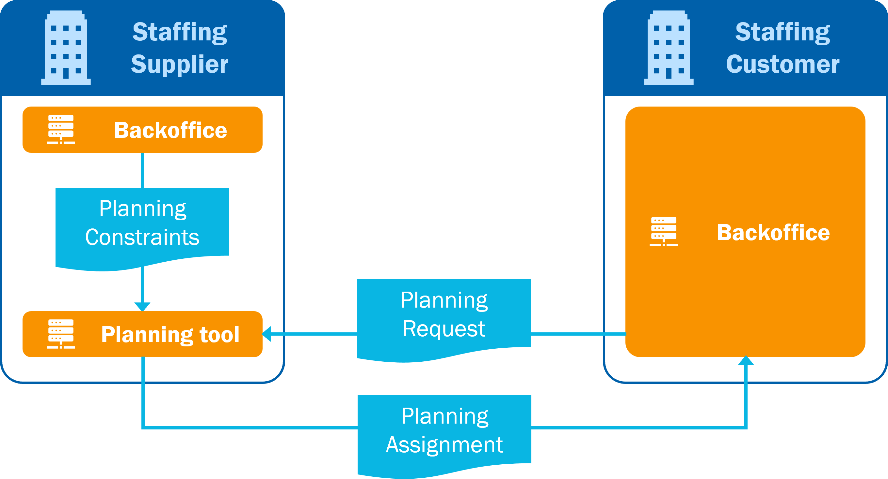

# Scenario 1: planning done in the system of the staffing supplier

In the first scenario, the staffing supplier is responsible for the planning. The staffing customer can make a PlanningRequest for a shift on a certain position and indicate any preferences. The planning system of the staffing supplier will create a schedule using the PlanningConstraints as defined in the backoffice. The created schedule is shared with the staffing customer (PlanningAssignment).

If there is a planning system on the staffing customer's side, the received schedule will be taken over by the staffing customer.

If changes to the schedule are necessary, an update to the PlanningRequest can be made. The staffing supplier processes this and shares a new schedule with the client.

A number of situations that are supported by scenario 1:

1. Information on the human resource come from the internal backoffice system of the staffing supplier to be used in the planning system of the staffing supplier.
2. The staffing supplier might also do the planning for the client's permanent employees. In this case, the HR information of the employee will come from the client instead of the staffing customer's backoffice.
3. A representative of the staffing customer does the planning in the staffing supplier's systems.

To help users better understand how these endpoints in different systems work together, the following pages include a series of sequence diagrams that illustrate the flow of REST calls in a particular scenario. These diagrams provide a visual representation of how the API can be used.
