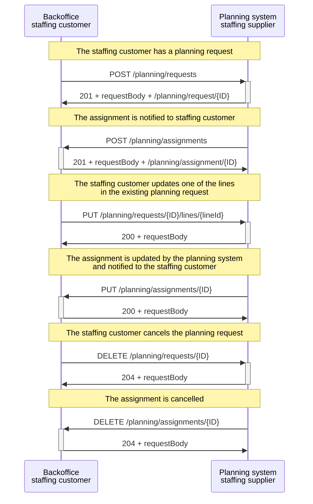

# Supplier's planning system and customer's backoffice

In this scenario, a staffing customer's backoffice system communicates with a staffing supplier's planning system. The staffing customer sends a planning request by sending a _POST /planning/requests_, and the planning system might respond with a status code 201 (planning request is created) + requestBody + the location (e.g., /planning/request/ID) to indicate success. The planning system may notify the staffing customer of the planning assignment by sending a _POST /planning/assignments_, and the customer may respond with a status code 201 to indicate successful creation.

Later on, the staffing customer may want to update one of the lines in the planning request. To do this, the customer sends a _PUT /planning/requests/{id}/lines/{lineId}_. The ../requests/{id} denotes the unique identifier of the planning request, which is assigned by the API server, and {lineId} denotes the unique identifier of a planning line in a planning request, assigned by the API requestor. The planning system may respond with a status code 200 if the update is successful. As a result, the planning system notifies the staffing customer of the updated assignment by sending a _PUT /planning/assignments/{id}_, and the customer responds with a status code 200.

Finally, the staffing customer may want to cancel the planning request by sending a _DELETE /planning/requests/{id}_, and the planning system responds with a status code 204 to indicate success. The planning system then cancels the assignment by sending a _DELETE /planning/assignments/{id}_, and the staffing customer responds with a status code 204.

**Note:** more information about the usage of the different identifiers in certain REST API paths can be found in this [section](../../API%20Specification/identifiers.md).

<figcaption align = "center">Diagram 2 - Flow between the backoffice system of the staffing customer and the planning system of a staffing supplier.</figcaption>
