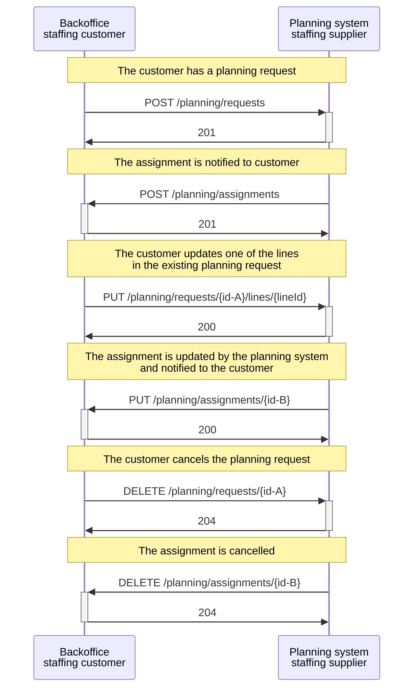

# Supplier's Planning System and Customer's Backoffice

## Sequence diagram:

### A typical flow with updates and cancellation between **the backoffice system staffing customer** and the **planning system of a staffing supplier**.

In this scenario, a customer's backoffice system communicates with a staffing supplier's planning system. The customer sends a planning request by sending a _POST /planning/requests_, and the planning system responds with a status code 201 to indicate success. The planning system notifies the customer of the assignment by sending a _POST /planning/assignments_, and the customer may respond with a status code 201.

Later on, the customer may want to update one of the lines in the planning request. To do this, the customer sends a _PUT /planning/requests/{id}/lines/{lineId}_. The ../requests/{id} denotes the id unique identifier of the planning request, and the {lineId} denotes the unique identifier of a planning line in a planning request. The planning system may respond with a status code 200 if the update is successful. As a consequence, the planning system notifies the customer of the updated assignment by sending a _PUT /planning/assignments/{id}_, and the customer responds with a status code 200.

Finally, the customer may want to cancel the planning request by sending a _DELETE /planning/requests/{id}_, and the planning system responds with a status code 204 to indicate success. The planning system then cancels the assignment by sending a _DELETE /planning/assignments/{id}_, and the customer responds with a status code 204.

<figcaption align = "center">Diagram.2 - Flow between the backoffice system staffing customer and the planning system of a staffing supplier</figcaption>
