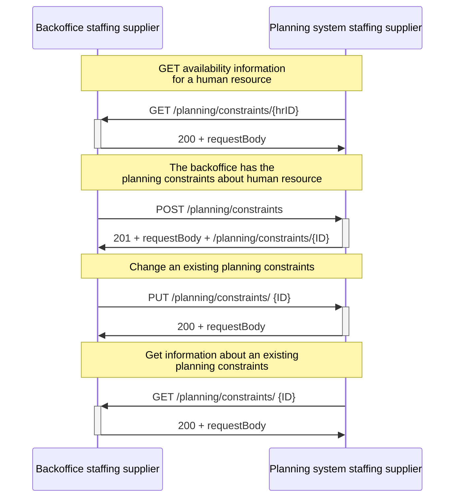

# Supplier's planning and backoffice system

The sequence diagram below involves communication between a staffing supplier's backoffice system and its planning system. The planning system sends a _GET /planning/constraints/hrID_ to retrieve availability information about a human resource. The API server of the backoffice system then responds with a status code 200 and the planning constraints of a particular human resource.

The backoffice system of the staffing supplier may also want to exchange the planning constraints of other human resources. This can be done by sending a _POST /planning/constraints_, and the planning system responds with a status code 201 + the requestBody + an unique resource identifier to indicate success.

Subsequently, the backoffice system may need to modify an already existing planning constraint by sending a _PUT /planning/constraints/{ID}_ where the {ID} denotes the unique resource identifier of the planning constraint, assigned by the API server. The planning system may respond with a status code 200 if the update is successful. Additionally, the planning system may want to retrieve information about an existing planning constraint object. This is done by sending a _GET /planning/constraints/{ID}_, and the backoffice system will respond with a status code 200 and the details of the constraint.

**Note:** more information about the usage of the different identifiers in certain REST API paths can be found in this [section](../../API%20Specification/identifiers.md).

<figcaption align = "center">Diagram 1 - Flow between the backoffice system and the planning system of a staffing supplier.</figcaption>
