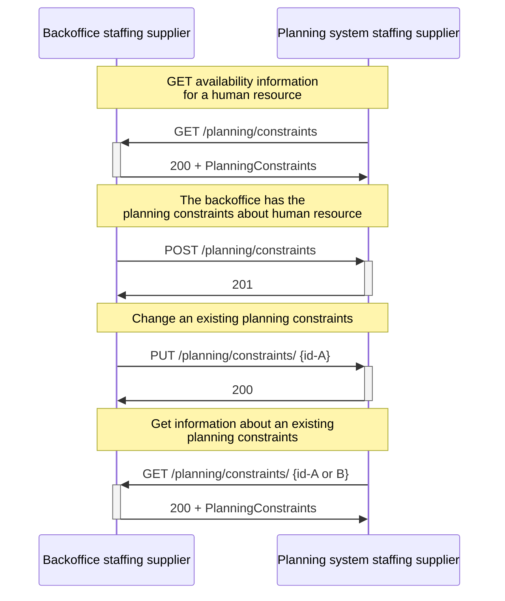

# Supplier's planning and backoffice system

:::caution
The SETU standard for planning and scheduling is currently under review. The documentation in this section is about version 0.9.

Version 1.0 is expected to be released by the SETU board on the 20th of June '23.
:::

The sequence diagram below involves communication between a staffing supplier's backoffice system and its planning system. The planning system sends a _GET /planning/constraints_ to retrieve availability information about a human resource. The backoffice system then responds with a status code 200 and the planning constraint of a particular human resource.

The backoffice system may also want to exchange the planning constraints of other human resources. This can be done by sending a _POST /planning/constraints_, and the planning system responds with a status code 201 to indicate success.

Subsequently, the backoffice system may need to modify an already existing planning constraint by sending a _PUT /planning/constraints/{id}_ where the {id} denotes the unique identifier of the planning constraint. The planning system may respond with a status code 200 if the update is successful. Additionally, the planning system may want to retrieve information about an existing planning constraint by sending a _GET /planning/constraints/{id}_, and the backoffice system will respond with a status code 200 and the details of the constraint.

<figcaption align = "center">Diagram.1 - Flow between the backoffice system and the planning system of a staffing supplier.</figcaption>
