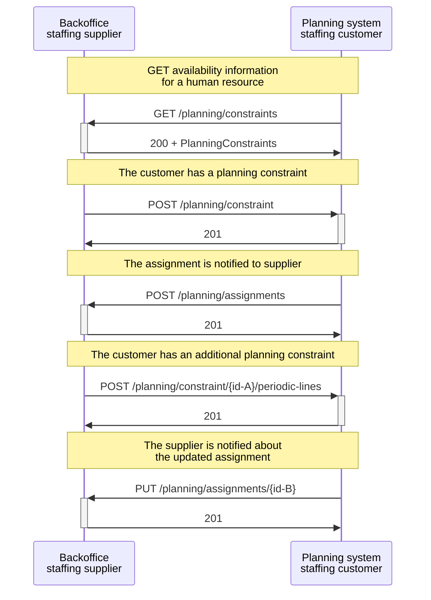

# Customer's planning system and supplier's backoffice

## Sequence diagram:

### A typical flow with updates and cancellation between the backoffice system of a **staffing supplier** and the **planning system of a staffing customer**.

This scenario involves communication between a staffing supplier's backoffice system and a staffing customer's planning system. The customer sends a _GET /planning/constraints_ to retrieve the availability information for a human resource, and the staffing supplier responds with a status code 200 and the requested planning constraints.

The staffing supplier also sends the planning constraints of other human resources by then creates a _POST /planning/constraint_, and the planning system of the staffing customer responds with a status code 201 to indicate success. The planning system notifies the supplier of the new assignment by sending a _POST /planning/assignments_, and the supplier responds with a status code 201.

Later on, the supplier may want to add a planning line to the planning constraint by sending a _POST /planning/constraint/{id}/periodic-lines_, and the planning system responds with a status code 201 to indicate success. Finally, the supplier is notified of the updated assignment by the planning system sending a _PUT /planning/assignments/{id},_ and the supplier responds with a status code 201.

<figcaption align = "center">Diagram.3 - the backoffice system of a staffing supplier and the planning system of a staffing customer.</figcaption>
