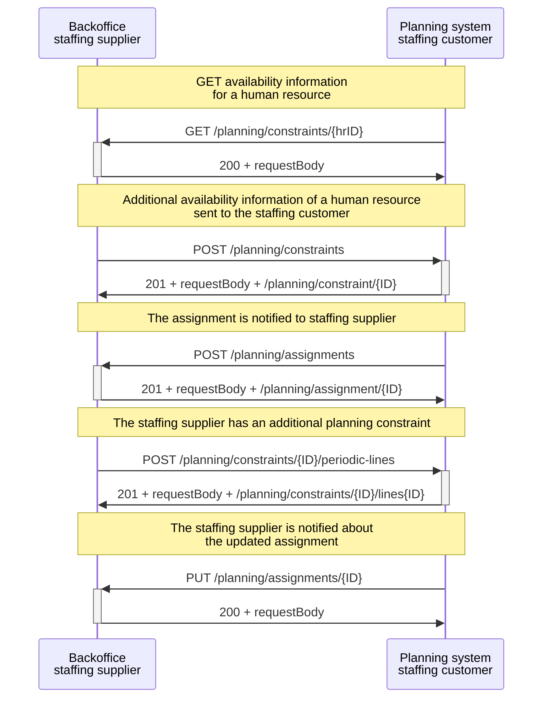

# Customer's planning system and supplier's backoffice

:::info
The sequence diagram on this page is specific to [scenario 2](../../planning/Scenario%202/Readme.md) for Planning and Scheduling, where the planning takes place in the staffing customer's planning system.
:::

This scenario involves communication between a staffing supplier's backoffice system and a staffing customer's planning system. The staffing customer sends a `GET /planning/constraints/hrID` to retrieve the availability information for a human resource, and the staffing supplier responds with a status code 200 and the requested planning constraints.

The staffing supplier can also send the planning constraints of other human resources by creating a `POST /planning/constraints`, and the planning system of the staffing customer responds with a status code 201, the requestBody, and an unique resource identifier to indicate success.

The planning system notifies the staffing supplier of the new assignment by sending a `POST /planning/assignments`, and the staffing supplier responds with a status code 201, the requestBody, and an unique resource identifier.

Later on, the staffing supplier may want to add a planning line to the planning constraint by sending a `POST /planning/constraints/{id}/periodic-lines`. The .../constraint/{ID} indicates the unique resource identifier of the planning constraints, which is assigned by the API server. The planning system may respond with a status code 201 to indicate success. Finally, the staffing supplier is notified of the updated assignment by the planning system sending a `PUT /planning/assignments/{id},` and the staffing supplier responds with a status code 201.

:::note
 More information about the usage of the different identifiers in certain REST API paths can be found in this [section](../../api/usage-notes/identifiers.md).
:::

<figcaption align = "center">Diagram 6 - Flow between the backoffice system of the staffing supplier and the planning system of the staffing customer.</figcaption>
