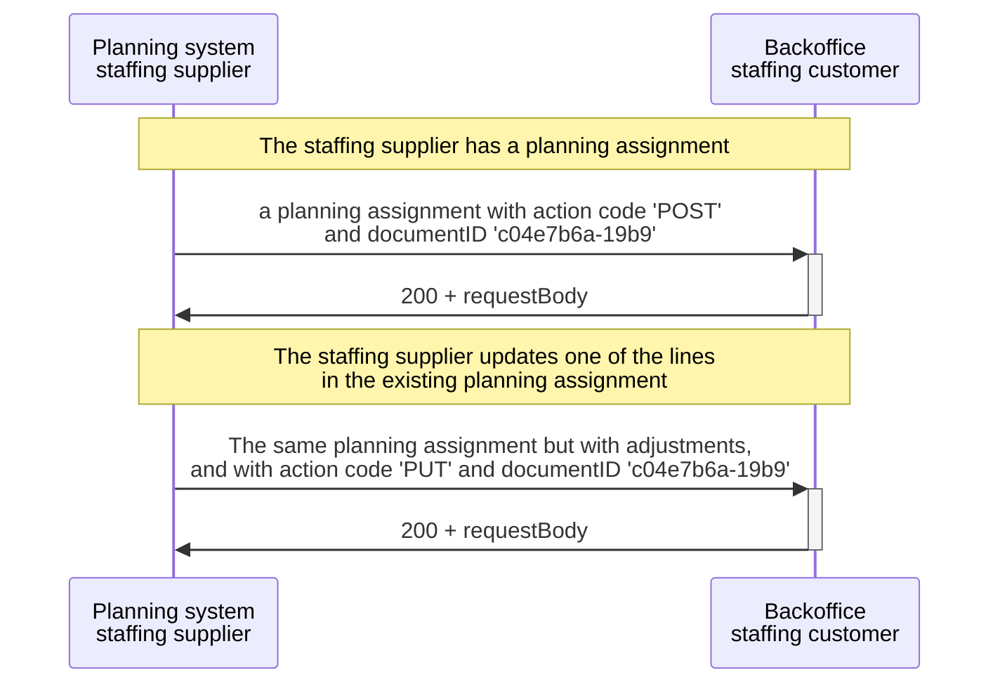

# Clarification SOAP

:::info
The SETU will not develop SOAP specifications for Planning and Scheduling messages and for the SETU v2.0 messages. The planning and scheduling messages are designed to be used in combination with REST APIs. However, we acknowledge that not everyone has made this transition yet. For such circumstances, this documentation page provides some clarifications.
:::

In response to the [change request](https://setu.semantic-treehouse.nl/issue/ChangeRequest_c03692a9-3af4-4f0e-8879-f110bf1a5171), this page clarifies the use of the Resource Identifier for SOAP web services.

## Handling Changes in SOAP Web Services
With the various REST calls (POST, PUT, DELETE, GET) of the REST APIs, adjustments can easily be made to previously sent messages. However, SOAP web services do not have these standardized calls. To keep this as generic as possible, the SETU has defined action codes in their standards. However, handling changes in previously sent messages to a SOAP API endpoint proves to be a challenge.

To make adjustments, the action codes defined in the message can be used. In this case, a label indicating whether it is a POST, DELETE, PUT, or GET can be provided. In practice, the message is resent with the processed changes and the corresponding label of the action code. This allows the receiving party to be aware of the changes made in the message.

In contrast to REST APIs, where a resource identifier is used, SOAP services resend the entire message, including the documentID. This allows the receiving party to identify which previously sent message the changes apply to.

## Example

The staffing supplier initially sends a planning assignment to the back-office of the staffing customer with an action code 'POST' and a document ID in the payload itself. The customer receives this message and responds a '200' status code and the same requestbody.

Later, when the supplier updates a line in the existing planning assignment, they resend the modified assignment with an action code 'PUT' and the same document ID. 

This sequence highlights that the action codes and adjustments are communicated within the message payload, and the same document ID is maintained for tracking purposes across requests.

