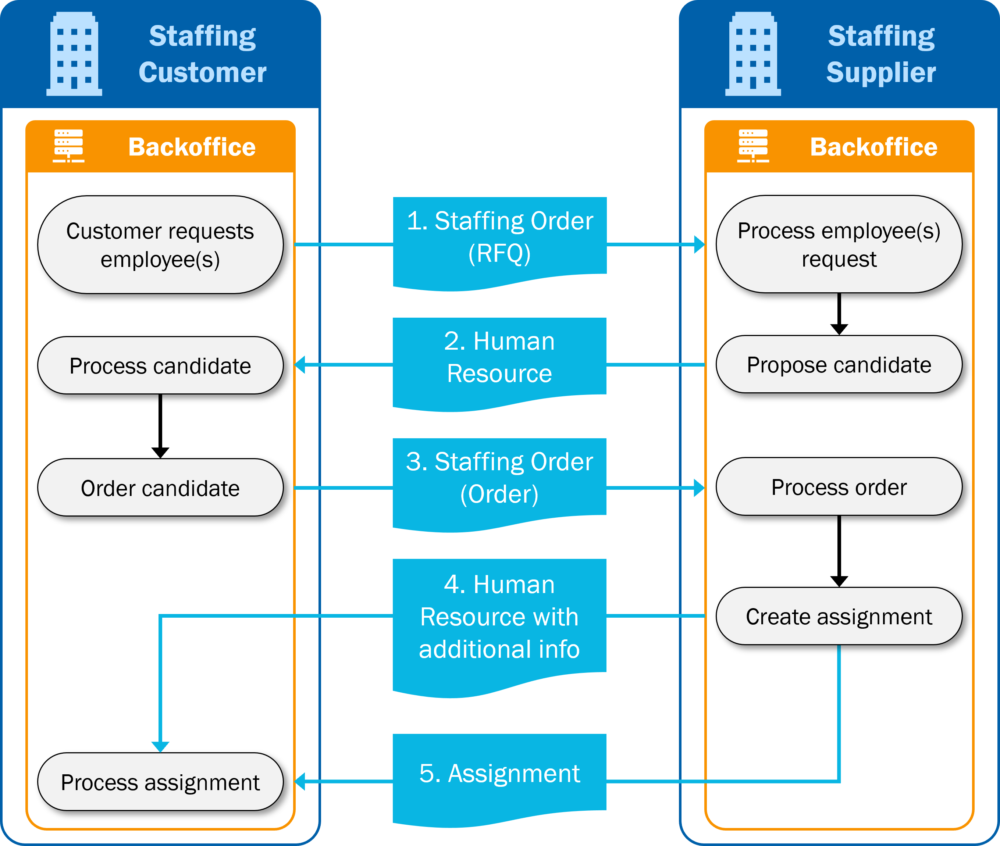
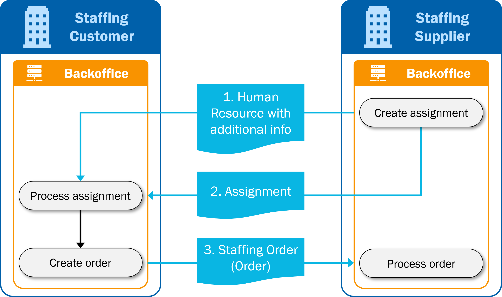

# Ordering & Selection and Assignment

:::caution DRAFT VERSION
The SETU Standard for Ordering & Selection, Assignment and Reporting Time & Expenses (Timecard) v2.0 are currently under review. The documentation in this section is a draft and subject to change.

We expect to release the final documentation at the end of 2024.
:::

:::info DOCUMENTATION
The message models can be found in [Semantic Treehouse](https://setu.semantic-treehouse.nl/specifications). There you can also find example messages and validation artifacts in both XML and JSON.

The REST API specifications can be found here: [Purchase to Pay API specifications](../api/oas-purchase-to-pay)
:::

The **SETU Standard for Ordering & Selection** consists of two message specifications:
- **Staffing Order** is used by a staffing customer to request and order (an) employee(s) for an open position.
- **Human Resource** is used by the staffing supplier to match a human resource to an open position.

The **SETU Standard for Assignment** is used by a staffing supplier for confirming the placement of a worker on a position at the staffing customer.

## Scope Ordering & Selection
The SETU Standard for Ordering and Selection is used for matching a human resource to an open position. It deals with electronically sending ordering and selection related information, including updates. The standard supports the exchange of ordering and selection information between two organizations; this implies that multi-party collaborations are out of scope.

This standard is intended for use only within the domain of human resourcing, and does not deal with, nor is intended to provide a general mechanism or design of the ordering and selection process, or a general purpose template for ordering and selection of a human resource outside this domain.

## Process description

1. The lifecycle of a procurement system process starts with the creation of the request for quotation at the staffing customer. The staffing customer sends the RFQ using the Staffing Order (Order type = 'RFQ') message (1) to the staffing supplier.
2. The staffing supplier searches its databases for matching human resources. If the staffing supplier has a matching human resource, (s)he sends an offer using the Human Resource message (2) to the staffing customer.
3. The staffing customer accepts the offer and sends a procurement order using the Staffing Order (Order type = 'Order') message (3) to the staffing supplier.
4. The staffing supplier can send additional information about the human resource using the Human Resource message (4).
5. Parallel the staffing supplier sends the Assignment message (5) to the staffing customer to confirm the placement of the human resource.

## Human Resource message
The content of the Human Resource message is tailored to where in the process the message is exchanged, especially to take into account the exchange of privacy-sensitive information: 
- If the **regular Human Resource message** is exchanged as an offer in response to the request for quotation (Staffing Order = 'RFQ'), the message may only contain limited personal data. Only the formatted name of the worker is shared, not the entire name. In addition, no contact details of the worker are exchanged and only limited address details, such as where the worker lives.
- After the assignment has been created by the staffing supplier, the suppler is allowed to also share the privacy-sensitive additional personal and contact information of the worker with the staffing customer. This situation is described as the **Human Resource message with additional information**. This message contains the full name of the worker, all contact and address information of the worker, and other personal data only required when the assignment comes into effect, such as legal document (passport) information.

## Staffing Order message
The Staffing Order message can be used at two different process steps. In the Staffing Order message itself the `order type` element must be used to specify for which of those two process steps the message is being exchanged:
- The **Staffing Order 'RFQ'** is used by the staffing customer to send a request for quotation to the staffing supplier to request worker(s).
- The **Staffing Order 'Order'** used by the staffing customer to send a procurement order to the staffing supplier to order the candidate worker(s) as proposed by the staffing supplier (in the Human Resource message).

The Staffing Order message facilitates two different use cases:
1. The Staffing Order, regardless of the order type used (either `RFQ` or `Order`), is used to request one worker for a position. Then at least the identifier and/or name of the requested worker must be specified.
2. The Staffing Order `RFQ` can be used to request multiple workers for one position. The amount of workers requested is indicated by the `position open quantity` element. The identifiers and names of the requested workers cannot be specified in the Staffing Order `RFQ`. In the Staffing Order `Order` is not allowed to use the `position open quantity` element. Therefore a Staffing Order `Order` message needs to be send for each ordered worker.

## Common variations on regular process
It is known that in practice variations and exceptions appear in the different phases of these processes. This section details the possibilities of varying with the messages and addresses what must be kept in mind when making exceptions.

In practice a part of the process is not always done by exchanging SETU messages. Agreements about requests, human resources and orders are made by telephone or in another (electronic) way. This implies that the processes that are described above can also partly appear.

It is also possible to use the SETU messages in a different order. It must however be kept in mind that when changing the order of the messages possibly problems can occur with referencing from one message to another. When messages are skipped or messages are received at a later stage in the process the identifiers of these messages will not be available. Consult the [overview of identifiers and references](./usage-notes/Identifiers-overview) on how identifiers of all SETU messages relate to each other.

## Assignment first variation

0. The first part of this process is done manually, without the use of SETU messages. Details about the request of the staffing customer and the first details about the proposed human resource are exchanged via telephone. Specific about this variation is that a Staffing Order (Order type = 'Order') message has not yet been exchanged and also the staffing supplier has not yet received a purchase order number via another channel.
1. The actual exchange of electronic messages starts after the creation of the assignment. The staffing supplier sends complete information about the human resource using the Human Resource message together with the Assignment message (2).
2. The staffing supplier sends the Assignment message (2) the staffing customer to confirm the placement of the human resource. This Assignment message does not refer to a specific staffing order, as the Staffing Order (Order type = 'Order') message or a purchase order number has not yet been exchanged.
3. After having received the Assignment message, the staffing customer sends a procurement order using the Staffing Order (Order type = 'Order') message (3) to the staffing supplier. The staffing supplier must relate the staffing order to the assignment that already has been exchanged.

## Comparing to v1.4
To compare Staffing Order v2.0, Human Resource v2.0 and Assignment v2.0 with their previous versions 1.4, you can view:
* the [mapping at the treeview of Staffing Order v2.0](https://setu.semantic-treehouse.nl/message-model-tree/Message_8ce31bab-da16-4e48-aac7-c745b1080bb1?panes=element_tree:Message_8ce31bab-da16-4e48-aac7-c745b1080bb1:c7jkjc:primary,element_tree:Message_1597759721_00689072:l6vreo);
* the [mapping at the treeview of Human Resource v2.0](https://setu.semantic-treehouse.nl/message-model-tree/Message_da7a87ec-72c9-414e-8da0-e4f942eb1a7c?panes=element_tree:Message_da7a87ec-72c9-414e-8da0-e4f942eb1a7c:xmr7of:primary,element_tree:Message_1597760582_00768543:aqg138);
* and the [mapping at the treeview of Assignment v2.0](https://setu.semantic-treehouse.nl/message-model-tree/Message_fc07cc98-14b0-4e7c-a52b-3240baa46194?panes=element_tree:Message_fc07cc98-14b0-4e7c-a52b-3240baa46194:s6577g:primary,element_tree:Message_1595323786_00145985:dfnxew).

When the mapping to v1.4 is selected (by clicking 'Add Specification' and the select the mapping provided), for each element in v2.0 a mapping is shown to one or multiple elements in v1.4, and vice versa. This gives users accelerated insight into how certain information has been included in the new message and thus facilitates the adoption of the new version of the standard.