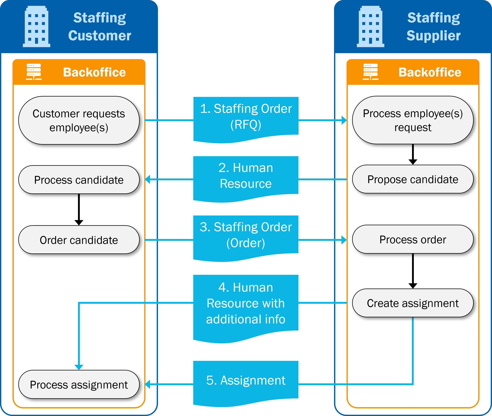
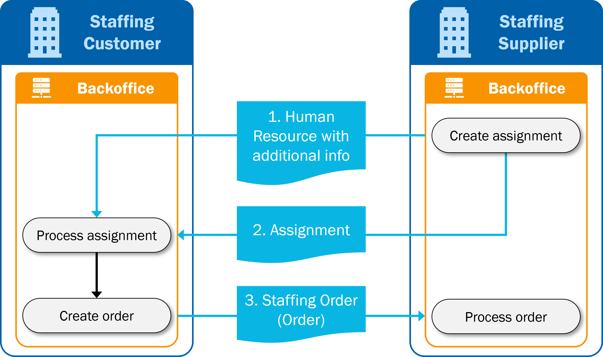

# Ordering & Selection and Assignment

:::info DOCUMENTATION
The message models can be found in [Semantic Treehouse](https://setu.semantic-treehouse.nl/specifications). There you can also find example messages and validation artifacts in both XML and JSON.

The REST API specifications can be found here: [Purchase to Pay API specifications](../api/oas-purchase-to-pay)
:::

The **SETU Standard for Ordering & Selection** consists of two message specifications:
- **Staffing Order** is used by a staffing customer to request and order one or more workers for an open position.
- **Human Resource** is used by the staffing supplier to match a human resource to an open position.

The **SETU Standard for Assignment** is used by a staffing supplier to confirm the placement of a worker in a position at the staffing customer.

## Scope Ordering & Selection
The SETU Standard for Ordering and Selection supports the electronic exchange of ordering and selection information, including updates, when matching a human resource to an open position. The standard supports exchanges between two organizations. Multi-party collaborations are out of scope.

This standard is intended for use only within the human-resourcing domain. It does not provide a general mechanism or design for ordering and selection processes outside this domain.

## Process description

1. The procurement process starts when the staffing customer creates a request for quotation. The staffing customer sends this request to the staffing supplier in a Staffing Order message with `order type` set to `RFQ` (1).
2. The staffing supplier searches for matching human resources. If a suitable human resource is available, the staffing supplier sends an offer to the staffing customer in a Human Resource message (2).
3. The staffing customer accepts the offer and sends a procurement order using the Staffing Order (`order type` = `Order`) message (3) to the staffing supplier.
4. The staffing supplier can send additional information about the human resource using the Human Resource message (4).
5. In parallel, the staffing supplier sends an Assignment message (5) to the staffing customer to confirm the placement of the human resource.

## Human Resource message
The content of the Human Resource message depends on the point at which it is exchanged in the process. This distinction protects privacy-sensitive information.

- When the **regular Human Resource message** is sent as an offer in response to a request for quotation (Staffing Order with `order type` set to `RFQ`), it may contain only limited personal data. It includes the worker's formatted name, but not the full name. It does not include contact details or a full address. Location information is limited to the city or municipality where the worker lives.
- After the staffing supplier has created the assignment, the supplier may share the worker's additional privacy-sensitive personal and contact information with the staffing customer. This is the **Human Resource message with additional information**. It includes the worker's full name, contact and address information, and other personal data required when the assignment takes effect, such as passport information.

## Staffing Order message
The Staffing Order message can be used at two different process steps. In the Staffing Order message itself the `order type` element must be used to specify for which of those two process steps the message is being exchanged:
- The **Staffing Order 'RFQ'** is used by the staffing customer to send a request for quotation to the staffing supplier to request worker(s).
- The **Staffing Order 'Order'** is used by the staffing customer to send a procurement order to the staffing supplier for the candidate worker proposed in the Human Resource message.

The Staffing Order message facilitates two different use cases:
1. The Staffing Order, regardless of the order type used (either `RFQ` or `Order`), is used to request one worker for a position. Then at least the identifier and/or name of the requested worker must be specified.
2. The Staffing Order `RFQ` can be used to request multiple workers for one position. The `position open quantity` element specifies the number of requested workers. In this case, the Staffing Order `RFQ` cannot specify the identifiers or names of individual workers. A Staffing Order `Order` cannot use the `position open quantity` element. Therefore, a separate Staffing Order `Order` message is required for each ordered worker.

## Variations on the regular process
In practice, parts of the process may take place outside the SETU message exchange. Agreements about requests, human resources, and orders may be made by telephone or through another electronic channel. As a result, parties may use only part of the regular SETU message process.

SETU messages can also be exchanged in a different order. Parties must then account for possible reference issues. When a message is skipped or received later in the process, its identifier is not yet available for use in another message. Consult the [overview of identifiers and references](./usage-notes/Identifiers-overview) for the relationship between identifiers in the SETU messages.

## Assignment confirmed before Staffing Order

In this variation, the staffing customer and staffing supplier have already agreed on the placement outside the SETU message exchange. Details about the request of the staffing customer and the first details about the proposed human resource are exchanged manually, for example via telephone. A defining characteristic of this variation is that a Staffing Order (Order type = 'Order') message has not yet been exchanged and also the staffing supplier has not yet received a purchase order number via another channel.

1. After the placement has been agreed manually, the staffing supplier sends the Human Resource message with additional information (1) and the Assignment message (2) to the staffing customer. The Assignment message confirms the placement but does not refer to a specific Staffing Order.
2. Once the procurement information is available, the staffing customer sends the Staffing Order `Order` to the staffing supplier. The staffing supplier links this order to the Assignment message that was already sent.

## Comparing to v1.4
To compare Staffing Order v2.0, Human Resource v2.0 and Assignment v2.0 with their previous versions 1.4, you can view:
* the [mapping at the treeview of Staffing Order v2.0](https://setu.semantic-treehouse.nl/message-model-tree/Message_8ce31bab-da16-4e48-aac7-c745b1080bb1?panes=element_tree:Message_8ce31bab-da16-4e48-aac7-c745b1080bb1:c7jkjc:primary,element_tree:Message_1597759721_00689072:l6vreo);
* the [mapping at the treeview of Human Resource v2.0](https://setu.semantic-treehouse.nl/message-model-tree/Message_da7a87ec-72c9-414e-8da0-e4f942eb1a7c?panes=element_tree:Message_da7a87ec-72c9-414e-8da0-e4f942eb1a7c:xmr7of:primary,element_tree:Message_1597760582_00768543:aqg138);
* and the [mapping at the treeview of Assignment v2.0](https://setu.semantic-treehouse.nl/message-model-tree/Message_fc07cc98-14b0-4e7c-a52b-3240baa46194?panes=element_tree:Message_fc07cc98-14b0-4e7c-a52b-3240baa46194:s6577g:primary,element_tree:Message_1595323786_00145985:dfnxew).

When the mapping to v1.4 is selected (by clicking 'Add Specification' and the select the mapping provided), for each element in v2.0 a mapping is shown to one or multiple elements in v1.4, and vice versa. This gives users accelerated insight into how certain information has been included in the new message and thus facilitates the adoption of the new version of the standard.