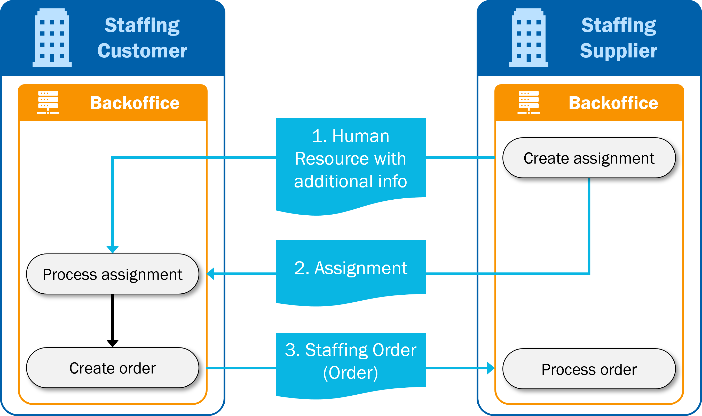

# Supported processes

## Regular staffing process

1. The lifecycle of a regular staffing process starts with the creation of the request for quotation at the staffing customer. The staffing customer sends the RFQ using the Staffing Order (Order type = 'RFQ') message (1) to the staffing supplier.
2. The staffing supplier searches its databases for matching human resources. If the staffing supplier has a matching human resource, (s)he sends an offer using the Human Resource message (2) to the staffing customer.
3. The staffing customer accepts the offer.
4. The staffing supplier can send additional information about the human resource using the Human Resource message (3).
5. Parallel the staffing supplier sends the Assignment message (4) to the staffing customer to confirm the placement of the human resource.

## Procurement system process

1. The lifecycle of a procurement system process starts with the creation of the request for quotation at the staffing customer. The staffing customer sends the RFQ using the Staffing Order (Order type = 'RFQ') message (1) to the staffing supplier.
2. The staffing supplier searches its databases for matching human resources. If the staffing supplier has a matching human resource, (s)he sends an offer using the Human Resource message (2) to the staffing customer.
3. The staffing customer accepts the offer and sends a procurement order using the Staffing Order (Order type = 'Order') message (3) to the staffing supplier.
4. The staffing supplier can send additional information about the human resource using the Human Resource message (4).
5. Parallel the staffing supplier sends the Assignment message (5) to the staffing customer to confirm the placement of the human resource.

## Common variations on regular process
It is known that in practice variations and exceptions appear in the different phases of these processes. This section details the possibilities of varying with the messages and addresses what must be kept in mind when making exceptions.

In practice a part of the process is not always done by exchanging SETU messages. Agreements about requests, human resources and orders are made by telephone or in another (electronic) way. This implies that the processes that are described above can also partly appear.

It is also possible to use the SETU messages in a different order. It must however be kept in mind that when changing the order of the messages possibly problems can occur with referencing from one message to another. When messages are skipped or messages are received at a later stage in the process the identifiers of these messages will not be available. Consult the [overview of identifiers and references](../UsageNotes/Identifiers-overview) on how identifiers of all SETU messages relate to each other.

### Example of variation on procurement system process

0. The first part of this process is done manually, without the use of SETU messages. Details about the request of the staffing customer and the first details about the proposed human resource are exchanged via telephone. Specific about this variation is that a Staffing Order (Order type = 'Order') message has not yet been exchanged and also the staffing supplier has not yet received a purchase order number via another channel.
1. The actual exchange of electronic messages starts after the creation of the assignment. The staffing supplier sends complete information about the human resource using the Human Resource message together with the Assignment message (2).
2. The staffing supplier sends the Assignment message (2) the staffing customer to confirm the placement of the human resource. This Assignment message does not refer to a specific staffing order, as the Staffing Order (Order type = 'Order') message or a purchase order number has not yet been exchanged.
3. After having received the Assignment message, the staffing customer sends a procurement order using the Staffing Order (Order type = 'Order') message (3) to the staffing supplier. The staffing supplier must relate the staffing order to the assignment that already has been exchanged.