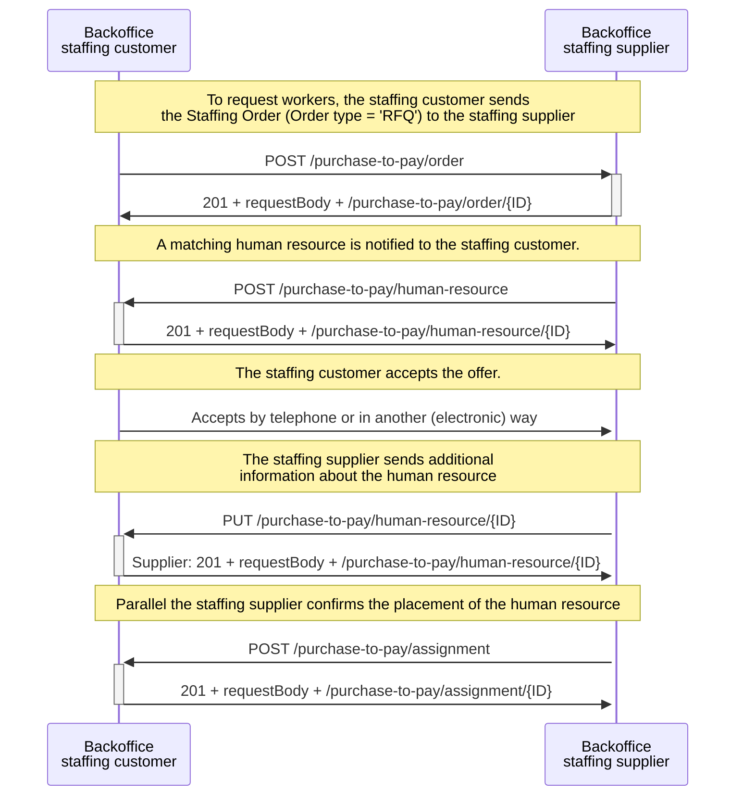
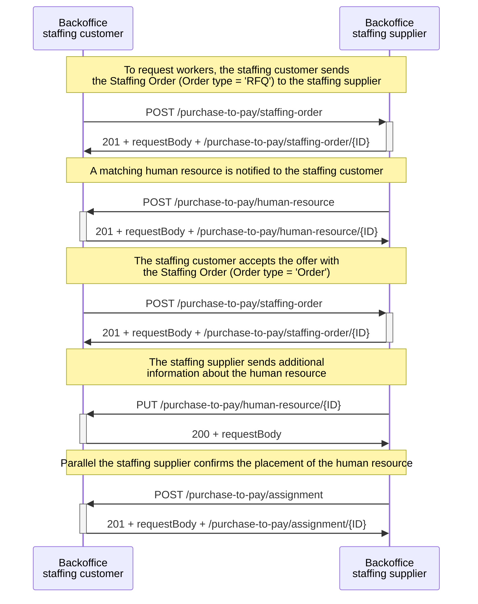
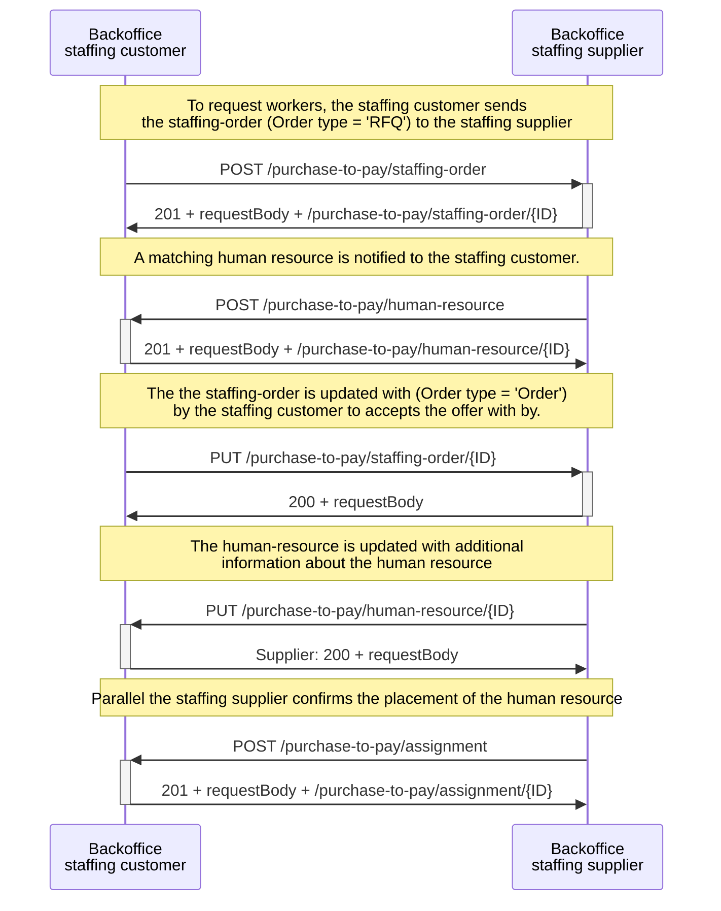
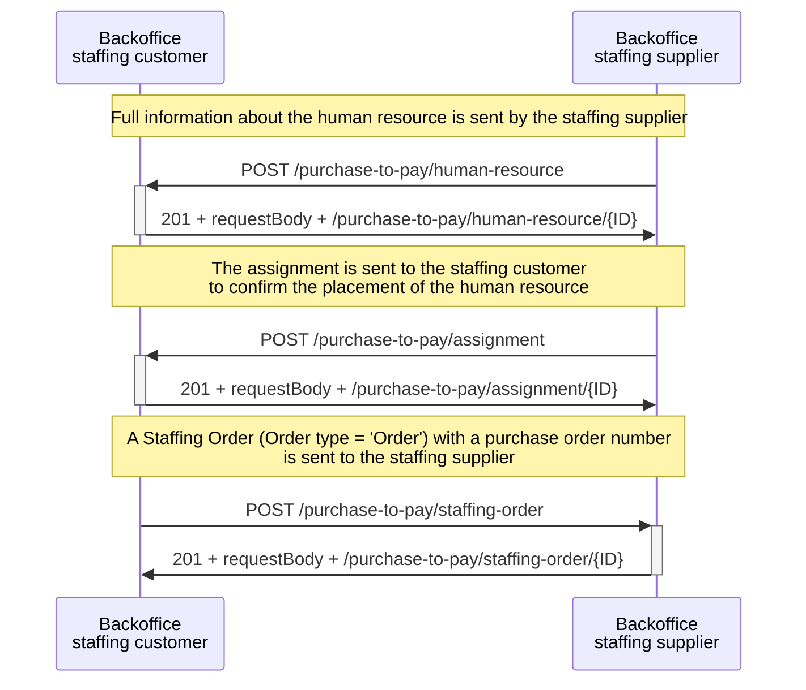
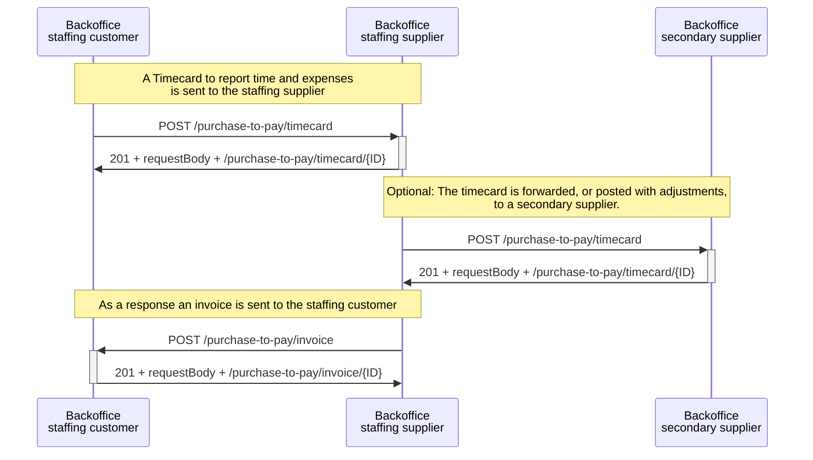
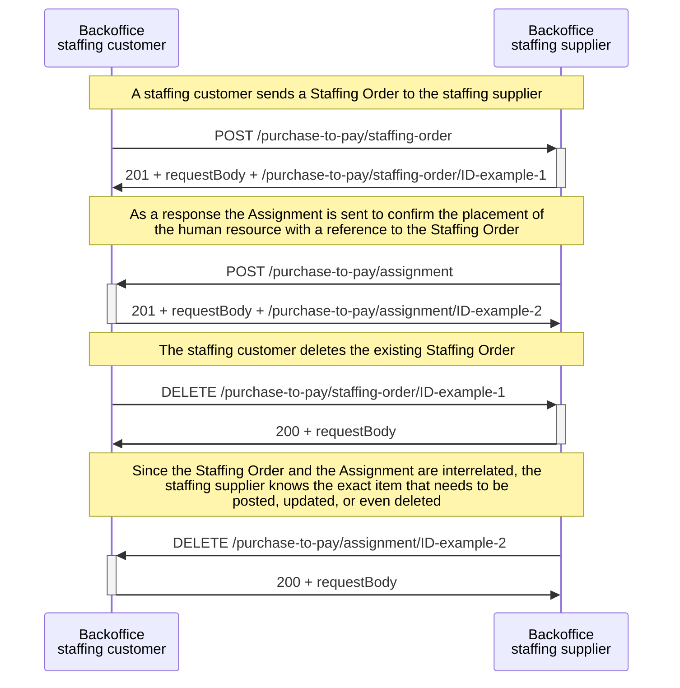
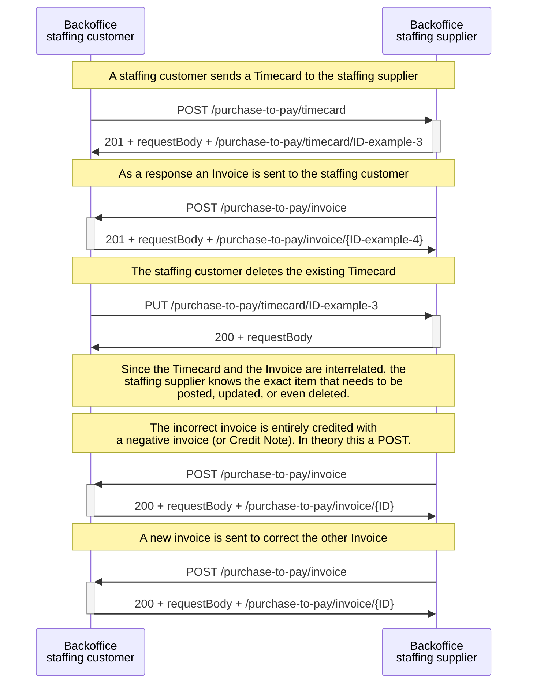

# Sequence diagrams

The page contains several sequence diagrams illustrating the communication between the backoffice systems of a staffing supplier and a staffing customer for exchanging the SETU Purchase to Pay messages.

<!--
### Regular Staffing Process

-->

## Ordering & Selection and Assignment

The sequence diagram below involves communication between a staffing customer's backoffice system and a staffing supplier's backoffice system. The ordering and selection process starts with the creation of a request for workers from the staffing customer. The staffing customer sends the Staffing Order (Order type = 'RFQ') message by making a `POST /purchase-to-pay/staffing-order` API call to the staffing supplier. The API server of the staffing supplier's backoffice system then responds with a status code 201, including the request body and a unique resource identifier for the staffing order, representing the location of the resource for API calls (GET, PUT, DELETE) at a later stage.

When a matching human resource is found, the staffing supplier notifies the staffing customer by sending a `POST /purchase-to-pay/human-resource`. The staffing customer's backoffice system responds with a status code 201, including the request body and a unique resource identifier. The staffing customer accepts the offer through a `POST /purchase-to-pay/staffing-order` (Staffing Order (Order type = 'Order')). Again, if the call succeeded, the staffing supplier's responds with a status code 201, the request body and a unique resource identifier for the order. 

The staffing supplier can send additional information about the human resource using a `PUT /purchase-to-pay/human-resource{ID}`. The staffing supplier is able to modify the earlier created human resource by using the received resource identifier, for context refer to: [handling identifiers](../API%20Specification/identifiers.md). Parallel, the staffing supplier confirms the placement of the human resource by a `POST /purchase-to-pay/assignment`. 

<figcaption align = "center">Diagram 1 - Procurement process between the staffing customer and the staffing supplier.</figcaption>

<!--
### OR

Kunnen we de accept via een staffing order doen, en dan een opnieuw sturen of de vorige aanpassen? Kunnen we de eerdere human resource aanpassen met meer informatie. 

<figcaption align = "center">Diagram X - X Flow between the staffing customer and the staffing supplier.</figcaption>

-->

### Variation on the regular process

The sequence diagram below involves a variation on the regular process. The first part of this process is done manually, without the use of SETU messages. Details about the staffing customer's request and the initial details about the proposed human resource are already exchanged in other ways. 

The actual exchange starts with the complete information of the human resource and the creation of the assignment. The staffing supplier sends in parallel a human resource and assignment through `POST /purchase-to-pay/human-resource` and `POST /purchase-to-pay/assignment` to the staffing customer. To both requests, the staffing customer's backoffice system responds with a status code 201, including the request body and a unique resource identifier for the human resource and the assignment. Recall that this assignment does not refer to a specific staffing order, as the staffing order or a purchase order number has not yet been communicated. After receiving the assignment, the staffing customer sends a staffing order including a purchase order number to the staffing supplier using a `POST /purchase-to-pay/staffing-order` call. 

The purchase order number, the documentId (see [identifiers overview](./UsageNotes/Identifiers-overview.md)) of the Staffing Order, can be used later as reference in the timecard and invoice. More information about this can be found below in the sequence diagram or in section [handling identifiers](../API%20Specification/identifiers.md).

<figcaption align = "center">Diagram 2 - a variation on the regular procurement process between the staffing customer and the staffing supplier.</figcaption>

## Timecard

The sequence diagram illustrates the process of reporting time and expenses via a timecard. The staffing customer sends a timecard to the staffing supplier through a `POST /purchase-to-pay/timecard`. Optionally, the staffing supplier can forward the timecard, either as-is or with adjustments, to a secondary supplier API endpoint through another `POST /purchase-to-pay/timecard` request. Finally, in response to the timecard(s), the staffing supplier sends an invoice to the staffing customer using `POST /purchase-to-pay/invoice`.

<figcaption align = "center">Diagram 3 - The process of reporting time and expenses between the staffing customer and staffing supplier.</figcaption>

## Changes & deletions

The sequence diagram below involves communication between a staffing customer and a staffing supplier about how changes and deletions in existing messages can affect previously sent messages. This process is asynchronous, meaning the request is made, but the requester does not wait for an immediate response and checks for it at a later stage. Identifiers are used to reference earlier messages. Here are examples of how changes in purchase-to-pay messages can impact previously sent messages.

<strong>Staffing Order & Assignment</strong>

The staffing customer sends a Staffing Order (Order type = 'Order') to the staffing supplier using a `POST /purchase-to-pay/staffing-order`, which includes a documentId as purchase order number. The staffing supplier responds with a status code 201, the request body and a unique resource identifier for the Staffing Order.

In response to the Staffing Order, the staffing supplier confirms the order of the human resource by sending a `POST /purchase-to-pay/assignment` to the staffing customer. This Assignment includes a reference to the Staffing Order via the purchase order number. Again, the response includes a status code 201, the request body and a unique resource identifier for the Assignment.

Later, the staffing customer deletes the existing Staffing Order. This update is sent using a `DELETE /purchase-to-pay/staffing-order/ID` with `ID-example-1` as identifier. Since the Staffing Order and the Assignment are interrelated via the same purchase order number, the staffing supplier knows exactly which item needs to be posted, updated, or even deleted based on the update to the Staffing Order. The staffing supplier sends the deleted assignment using a `DELETE /purchase-to-pay/assignment/ID` with ID-example-2 as identifier. 

<strong>Timecard & Invoice</strong>

A change or deletion of a timecard can impact a previously sent invoice. The staffing customer sends a Timecard with the number of hours the human resource has worked using a `POST /purchase-to-pay/timecard`. In response to the timecard, or multiple timecards, the staffing supplier sends a `POST /purchase-to-pay/invoice`. This invoice includes a reference to the timecard via the purchase order number.

Later, the staffing customer updates the existing timecard because a mistake was made or any other reason. This update is sent using a `PUT /purchase-to-pay/timecard/ID` with `ID-example-3` as the identifier. Since the timecard and the invoice are interrelated via the purchase order number, the staffing supplier knows exactly which item needs to be posted, updated, or even deleted based on the deleted timecard. The incorrect invoice is entirely credited with a negative invoice (or Credit Note) using a  `POST /purchase-to-pay/invoice/ID-example-4` and sends a new invoice using a `POST /purchase-to-pay/invoice` to correct the previously sent invoice.

According to the [NLCIUS](https://www.forumstandaardisatie.nl/open-standaarden/nlcius) (Dutch specification of a European Invoice), which the SETU uses, there are two ways to correct an already sent invoice:

1. The incorrect invoice is entirely credited with a negative invoice (or Credit Note). This negative invoice has its own number and refers to the original invoice. A correct invoice is then issued. This new invoice also has its own number and refers to the original invoice. This method is the easiest to process and is preferred.

2. Alternatively, a corrective invoice can be sent in which the incorrect items, discounts, and/or surcharges are entirely credited, and the correct items/discounts/surcharges are listed. This corrective invoice also has its own number and refers to the original invoice.

