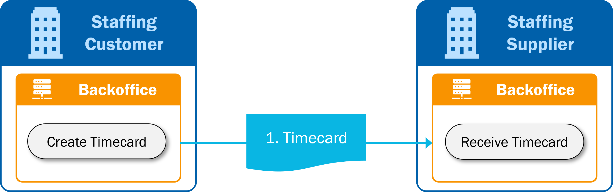
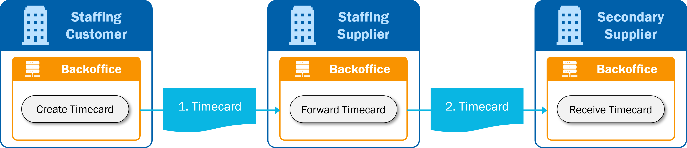
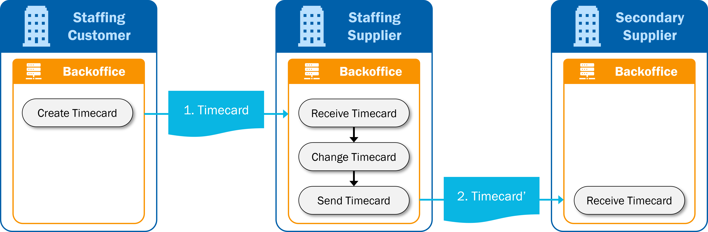
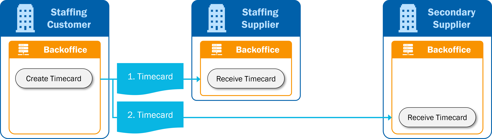

# Reporting Time and Expenses (Timecard)

:::caution DRAFT VERSION
The SETU Standard for Ordering & Selection, Assignment and Reporting Time & Expenses (Timecard) v2.0 are currently under review. The documentation in this section is a draft and subject to change.

We expect to release the final documentation at the end of 2024.
:::

:::info DOCUMENTATION
The message models can be found in [Semantic Treehouse](https://setu.semantic-treehouse.nl/specifications). There you can also find example messages and validation artifacts in both XML and JSON.

The REST API specifications can be found here: [Purchase to Pay API specifications](../api/oas-purchase-to-pay)
:::

## Scope
The SETU Standard for Reporting Time and Expenses is targeted at the process of reporting time & expenses in the staffing industry. It contains information models that describe the moments (when) and the content (what) of information exchange. It deals with capturing and electronically sending time recording information and expense related information, including corrections.

The standard supports a single transfer of information, from one sender of registration information to a receiver. The receiver may then proceed to process the information registered, e.g. for invoicing, payroll activities or for retransmission to another party. This implies that multi-party collaborations are out of scope.

This standard is intended for use only within the domain of staffing industry, and does not deal with, nor is intended to provide a general mechanism or design of reporting time & expenses, or a general purpose template for reporting time & expenses outside this domain.

## Regular reporting process
The main process is the regular reporting of time and expenses. This process is simple, the main reason
being that the actual response (the invoice) is not included in this process: the invoice process is specified in
the SETU Standard for Invoicing.

1. The life-cycle starts with the creation of the timecard at the staffing customer.
2. The staffing customer sends the timecard to the staffing supplier (1).

## Secondary supply process
This section details the timecard processes in the case of secondary supply. Secondary supply means that a staffing supplier provides human resources of another staffing supplier (subcontractor) to its customer. The subcontractor we call secondary supplier.

There are three different options regarding the process of sending the timecard to the secondary supplier. The SETU standard for Reporting Time & Expenses supports these options, but they are not described in detail.

### Option 1: Direct forward

1. The life-cycle starts with the creation of the timecard at the staffing customer.
2. The staffing customer sends the timecard to the staffing supplier (1).
3. The staffing supplier receives the timecard and forwards it directly to the secondary supplier (2). The timecard is not changed.

:::info
This option requires additional agreements between the involved parties about identifiers and references in order to recognize timecards of secondary supply assignments. SETU does not specify how this should or must be done.
:::

### Option 2: Adapt timecard

1. The life-cycle starts with the creation of the timecard at the staffing customer.
2. The staffing customer sends the timecard to the staffing supplier (1).
3. The staffing supplier receives the timecard and adapts the timecard to the assignment with the secondary supplier. This may include identifiers, references to involved parties, assignment reference number, rates and other elements.
4. The staffing supplier sends the adapted timecard (2) to the secondary supplier.

:::info
This option can be considered the ‘normal’ timecard process because in the second part of the process
the staffing supplier acts as a staffing customer and the secondary supplier as staffing supplier.
:::

### Option 3: Simultaneous communication

1. The life-cycle starts with the creation of the timecard at the staffing customer.
2. The staffing customer sends the timecard to the staffing supplier (1).
3. The staffing customer is aware of the secondary supply assignment and also sends the timecard to the secondary supplier (2).

:::info
This option requires additional agreements between the involved parties about identifiers and references in order to recognize timecards of secondary supply assignments. SETU does not specify how this should or must be done.
:::

## Mapping to Timecard v1.4
To compare Timecard v2.0 with the previous version Timecard v1.4, you can view the [mapping at the treeview of Timecard v2.0](https://setu.semantic-treehouse.nl/message-model-tree/Message_39a2ff1b-43b3-40fc-930e-d85488bb57bb?panes=element_tree:Message_39a2ff1b-43b3-40fc-930e-d85488bb57bb:qvsi8y:primary,element_tree:Property_1478175108759638:u5oe3d). When the mapping to Timecard v1.4 is selected (by clicking 'Add Specification' and the select the mapping provided), for each element in v2.0 a mapping is shown to one or multiple elements in v1.4, and vice versa. This gives users accelerated insight into how certain information has been included in the new message and thus facilitates the adoption of the new version of the standard.