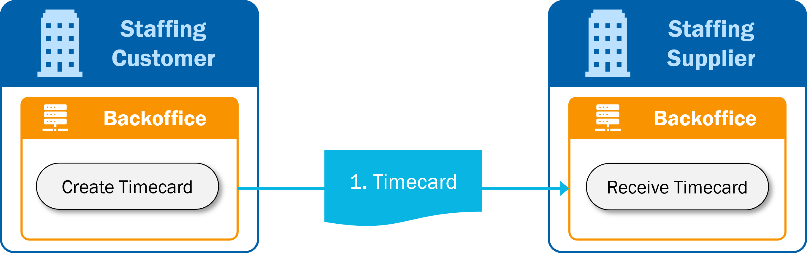
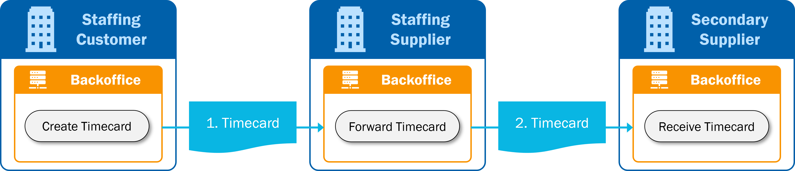
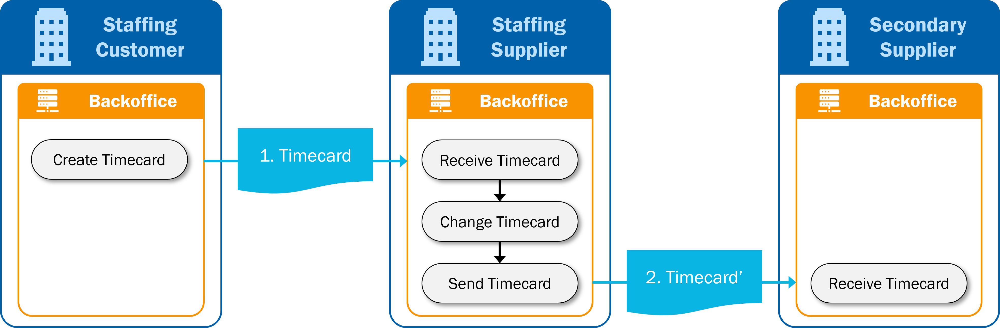
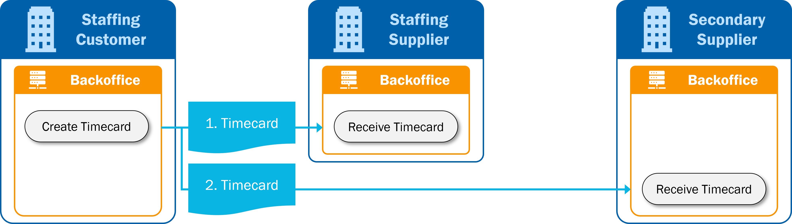

# Reporting Time and Expenses (Timecard)

:::info DOCUMENTATION
The message models can be found in [Semantic Treehouse](https://setu.semantic-treehouse.nl/specifications). There you can also find example messages and validation artifacts in both XML and JSON.

The REST API specifications can be found here: [Purchase to Pay API specifications](../api/oas-purchase-to-pay)
:::

## Scope
The SETU Standard for Reporting Time and Expenses covers the reporting of time and expenses in the staffing industry. It contains information models that describe when information is exchanged and what it contains. The standard covers the recording and electronic exchange of time and expense information, including corrections.

The standard supports a single transfer of information from one sender to one receiver. The receiver may then process the information, for example for invoicing, payroll activities or retransmission to another party. Multi-party collaborations are out of scope.

This standard is intended for use only in the staffing industry. It does not define a general mechanism for reporting time and expenses or a general-purpose template for use outside this domain.

## Regular reporting process
The main process is the regular reporting of time and expenses. It is simple because the actual response, the invoice, is not part of this process; invoicing is specified in the SETU Standard for Invoicing.

1. The lifecycle starts with the creation of the timecard by the staffing customer.
2. The staffing customer sends the timecard to the staffing supplier (1).

## Secondary supply process
This section describes the timecard processes for secondary supply. Secondary supply means that a staffing supplier provides its customer with human resources from another staffing supplier (the subcontractor). This subcontractor is called the secondary supplier.

The timecard can be sent to the secondary supplier in three ways. The SETU Standard for Reporting Time and Expenses supports all three options, but does not specify them in detail.

### Option 1: Direct forward

1. The lifecycle starts with the creation of the timecard by the staffing customer.
2. The staffing customer sends the timecard to the staffing supplier (1).
3. The staffing supplier receives the timecard and forwards it directly to the secondary supplier (2), without changing it.

:::info
This option requires additional agreements between the parties on identifiers and references for recognizing timecards for secondary supply assignments. SETU does not specify how this should be done.
:::

### Option 2: Adapt timecard

1. The lifecycle starts with the creation of the timecard by the staffing customer.
2. The staffing customer sends the timecard to the staffing supplier (1).
3. The staffing supplier receives the timecard and adapts it to the assignment with the secondary supplier. This may include identifiers, references to the parties involved, the assignment reference number, rates and other elements.
4. The staffing supplier sends the adapted timecard (2) to the secondary supplier.

:::info
This option can be considered the standard timecard process because, in the second part of the process, the staffing supplier acts as a staffing customer and the secondary supplier as a staffing supplier.
:::

### Option 3: Simultaneous communication

1. The lifecycle starts with the creation of the timecard by the staffing customer.
2. The staffing customer sends the timecard to the staffing supplier (1).
3. The staffing customer is aware of the secondary supply assignment and also sends the timecard directly to the secondary supplier (2).

:::info
This option requires additional agreements between the parties on identifiers and references for recognizing timecards for secondary supply assignments. SETU does not specify how this should be done.
:::

## Mapping to Timecard v1.4
To compare Timecard v2.0 with the previous version, Timecard v1.4, view the [Timecard v2.0 mapping in the tree view](https://setu.semantic-treehouse.nl/message-model-tree/Message_39a2ff1b-43b3-40fc-930e-d85488bb57bb?panes=element_tree:Message_39a2ff1b-43b3-40fc-930e-d85488bb57bb:qvsi8y:primary,element_tree:Property_1478175108759638:u5oe3d). Select the mapping to Timecard v1.4 by clicking **Add Specification** and selecting the provided mapping. The tree view then shows, for each element in v2.0, the corresponding element or elements in v1.4, and vice versa. This helps users understand how the information was included in the new message and facilitates adoption of the new version of the standard.