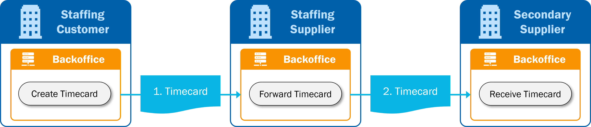
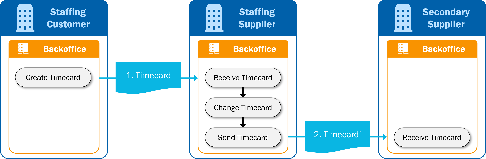

# Supported processes

## Regular time & expenses reporting process
The main process is the regular reporting of time and expenses. This process is simple, the main reason
being that the actual response (the invoice) is not included in this process: the invoice process is specified in
the SETU Standard for Invoicing.

1. The life-cycle starts with the creation of the timecard at the staffing customer.
2. The staffing customer sends the timecard to the staffing supplier (1).

## Secondary supply process
This section details the timecard processes in the case of secondary supply. Secondary supply means that a staffing supplier provides human resources of another staffing supplier (subcontractor) to its customer. The subcontractor we call secondary supplier.

There are three different options regarding the process of sending the timecard to the secondary supplier. The SETU standard for Reporting Time & Expenses supports these options, but they are not described in detail.

### Option 1: Direct forward

1. The life-cycle starts with the creation of the timecard at the staffing customer.
2. The staffing customer sends the timecard to the staffing supplier (1).
3. The staffing supplier receives the timecard and forwards it directly to the secondary supplier (2). The timecard is not changed.

:::info
This option requires additional agreements between the involved parties about identifiers and references in order to recognize timecards of secondary supply assignments. SETU does not specify how this should or must be done.
:::

### Option 2: Adapt timecard

1. The life-cycle starts with the creation of the timecard at the staffing customer.
2. The staffing customer sends the timecard to the staffing supplier (1).
3. The staffing supplier receives the timecard and adapts the timecard to the assignment with the secondary supplier. This may include identifiers, references to involved parties, assignment reference number, rates and other elements.
4. The staffing supplier sends the adapted timecard (2) to the secondary supplier.

:::info
This option can be considered the ‘normal’ timecard process because in the second part of the process
the staffing supplier acts as a staffing customer and the secondary supplier as staffing supplier.
:::

### Option 3: Simultaneous communication

1. The life-cycle starts with the creation of the timecard at the staffing customer.
2. The staffing customer sends the timecard to the staffing supplier (1).
3. The staffing customer is aware of the secondary supply assignment and also sends the timecard to the secondary supplier (2).

:::info
This option requires additional agreements between the involved parties about identifiers and references in order to recognize timecards of secondary supply assignments. SETU does not specify how this should or must be done.
:::