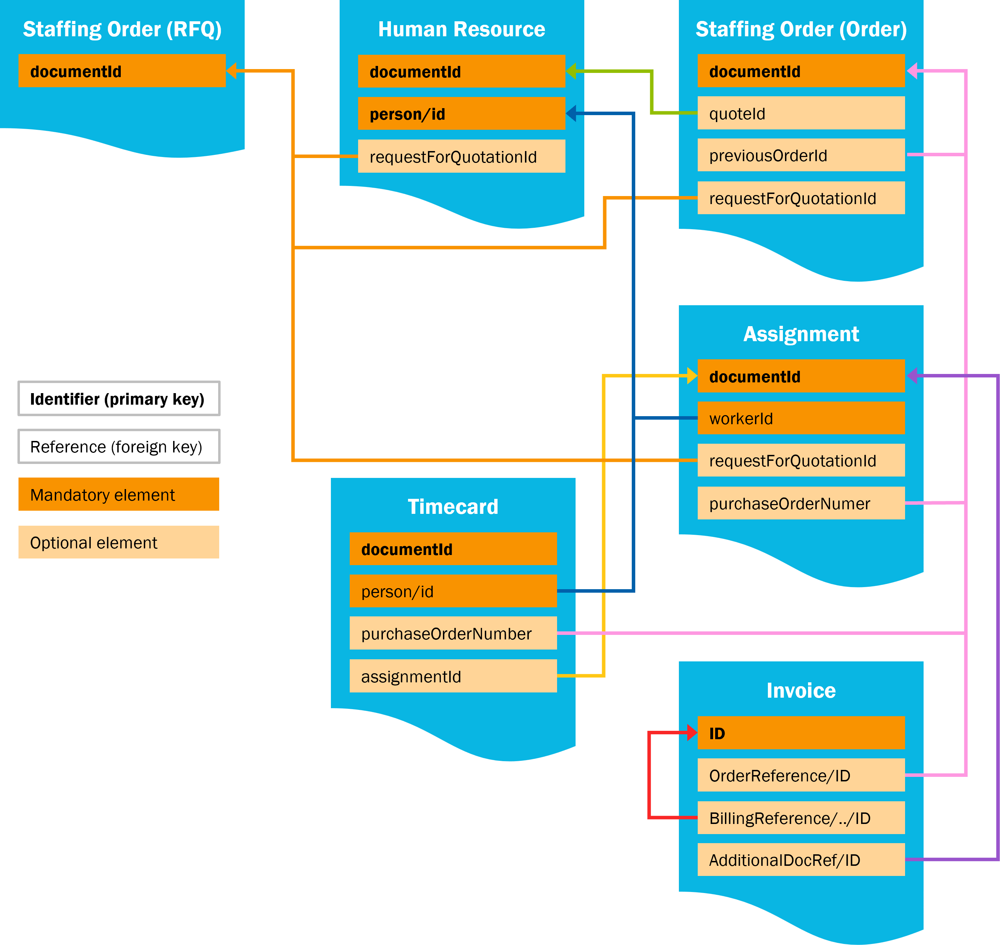

# Overview of identifiers and references

:::caution
The SETU Standard for Ordering & Selection, Assignment and Reporting Time & Expenses (Timecard) v2.0 are currently under review. The documentation in this section is a draft and subject to change.

We expect to release the final documentation at the end of 2024.
:::

The figure below provides an overview of how different identifiers relate to each other in the messages described in the 2.x versions of the Ordering & Selection, Assignment, Reporting Time & Expenses and Invoice standards.

The blocks with bold text illustrate identifiers of the message itself. Full orange blocks illustrate mandatory elements, whereas light orange blocks indicate optional elements.

