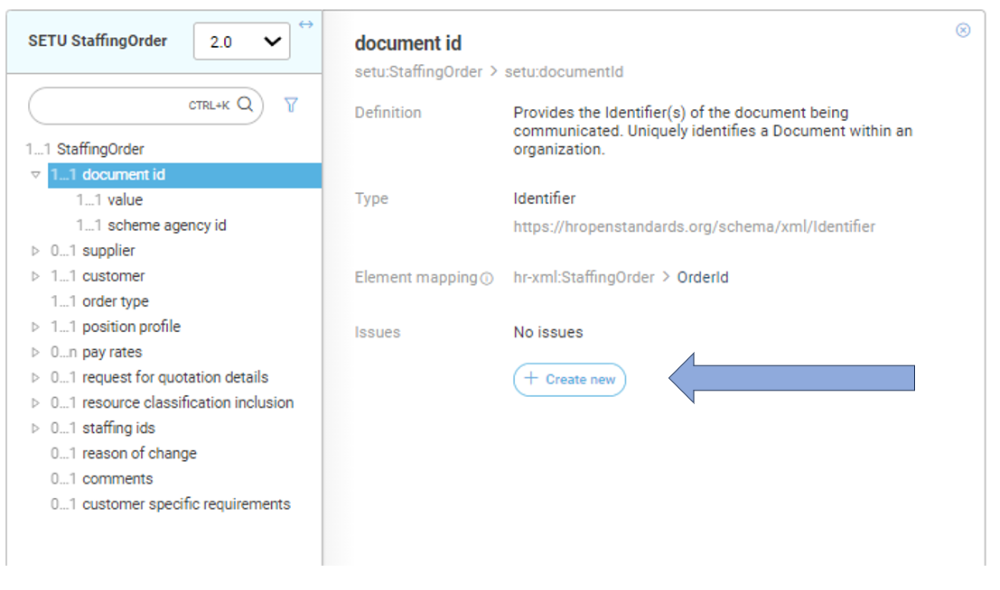

# How to review?

### Where to find the specifications?

The management and maintenance of these message specifications are carried out in our [SETU standards portal](https://setu.semantic-treehouse.nl/#/Home). The message specifications can be found here:

- [Staffing Order](https://setu.semantic-treehouse.nl/message-model-tree/Message_8ce31bab-da16-4e48-aac7-c745b1080bb1?panes=element_tree:Message_8ce31bab-da16-4e48-aac7-c745b1080bb1:v87px1:primary): for matching a human resource to an open position.
- [Human Resource](https://setu.semantic-treehouse.nl/message-model-tree/Message_da7a87ec-72c9-414e-8da0-e4f942eb1a7c?panes=element_tree:Message_da7a87ec-72c9-414e-8da0-e4f942eb1a7c:q2hhbw:primary): for matching a human resource to an open position.
- [Assignment](https://setu.semantic-treehouse.nl/message-model-tree/Message_fc07cc98-14b0-4e7c-a52b-3240baa46194?panes=element_tree:Message_fc07cc98-14b0-4e7c-a52b-3240baa46194:51f8vt:primary): for confirming the placement of a human resource to a position. 
- [Timecard](https://setu.semantic-treehouse.nl/message-model-tree/Message_39a2ff1b-43b3-40fc-930e-d85488bb57bb?panes=element_tree:Message_39a2ff1b-43b3-40fc-930e-d85488bb57bb:be72zv:primary): for reporting time & expenses in the staffing industry. 

The corresponding documentation and API specifications can be found on the next pages of this documentation portal.

### How to provide feedback?

Review comments for the public consultation can be submitted via the SETU standards portal itself, where also the message specifications are located. We would like to ask you to submit your review comment at the specific element you have a comment about, via the Q&A tab as shown in the picture below.

A login is required to submit your comments, but logging in can be done with an existing Microsoft, LinkedIn, Google or GitHub. Only your e-mail address will be visible for us, so we can get in contact with you if we have other questions about your review comment(s).
