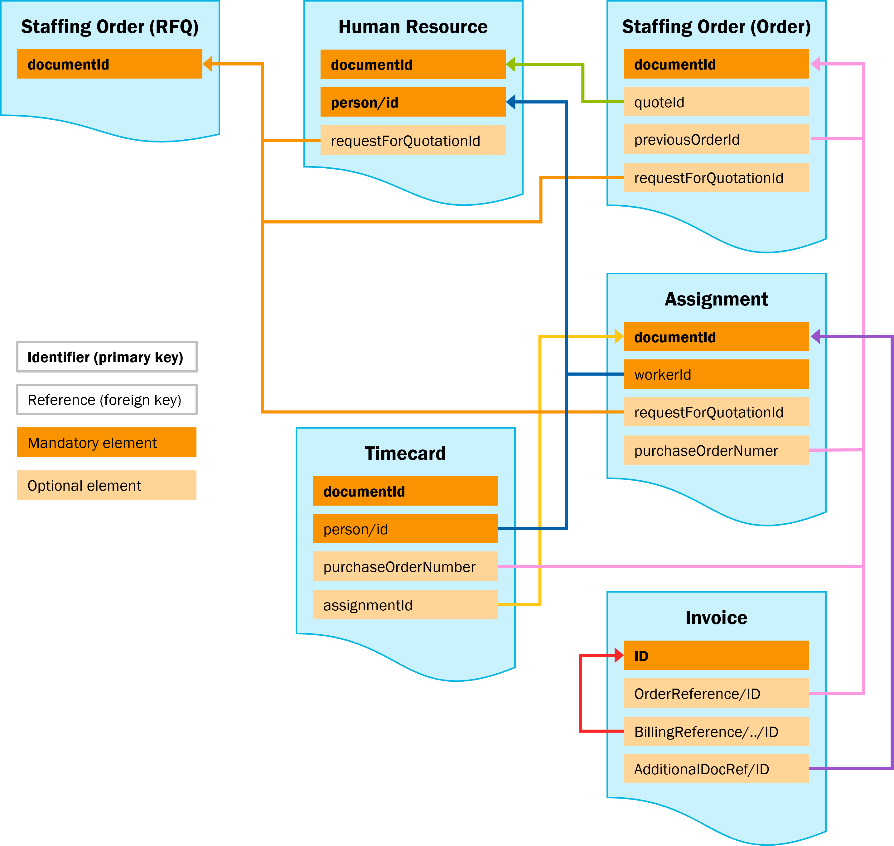

# Overview of identifiers and references

The figure below provides an overview of how different identifiers relate to each other in the messages described in the 2.x versions of the Ordering & Selection, Assignment, Reporting Time & Expenses and Invoice standards.

Blocks with bold text represent identifiers of the message itself. Full orange blocks represent mandatory elements; light orange blocks represent optional elements.

